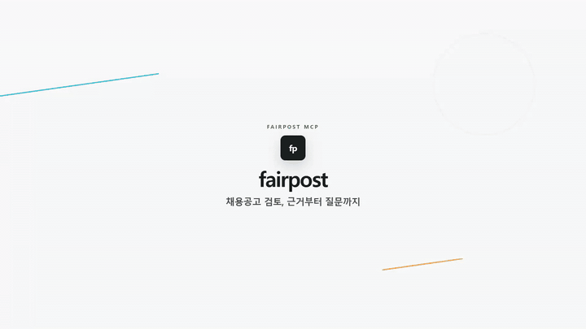

<div align="center">

# FairPost MCP

[](docs/assets/fairpost-promo.mp4)

**채용공고의 표현, 빠진 정보, 확인할 질문을 근거와 함께 정리하는 결정론적 리뷰 도구**

[웹에서 체험하기](https://fairmcp.vercel.app/web/) · [24초 데모](docs/assets/fairpost-promo.mp4) · [빠른 시작](#빠른-시작) · [MCP 연결](#mcp-연결)

</div>

FairPost는 채용공고문에서 다음 세 가지를 한 번에 정리합니다.

- 관련 법령과 함께 다시 살펴볼 표현
- 공고문에서 확인되지 않은 절차·정보
- 채용담당자가 후속 검토할 질문

기본 점검은 같은 입력과 규칙 버전에 항상 같은 결과를 반환합니다. LLM이나 외부
API를 호출하지 않으며 점수, 등급, 합격·통과 판정도 만들지 않습니다. 선택형
AI·현행 법령 보강은 서버에 Korean Law MCP와 AI API 키가 설정되어 있고 사용자가
**보강 실행**을 누른 요청에서만 Korean Law MCP와 Claude, GPT 또는 Gemini를 사용합니다. 현재 공개
웹에는 AI API 키가 설정되어 있지 않아 이 보강은 사용할 수 없습니다(아래
‘AI·현행 법령 보강’ 참고).

> FairPost의 결과는 사람의 검토를 돕는 참고자료이며 공정성 판정이나 법률 자문이
> 아닙니다. “확인되지 않음”은 해당 절차가 없다는 뜻이 아니라 공고문에서 찾지
> 못했다는 뜻입니다.

## 빠른 시작

### 어떤 방법으로 시작할까요?

| 방법 | 이런 분께 | 필요한 것 | 공고문 처리 위치와 개인정보 |
|---|---|---|---|
| **웹** ([배포 앱](https://fairmcp.vercel.app/web/)) | 설치 없이 공고를 바로 검토하려는 HR 담당자 | 웹 브라우저 | 기본 모드에서는 공고문이 기기 밖으로 나가지 않습니다. 선택형 AI·법령 보강에서 **보강 실행**을 누른 요청만 서버로 전송됩니다. |
| **CLI** | 공고 파일 여러 개를 점검하거나 JSON 결과·검토 패킷이 필요한 분 | Python 3.11 이상, 저장소 내려받기와 설치 | 내 PC 안에서만 실행됩니다. 단 `--review-packet`은 Korean Law MCP를 설정한 경우에만 법령명·조문번호를 외부에 조회합니다. |
| **로컬 MCP** (로컬 웹 포함) | Claude Code·Codex 같은 AI 도구에서 호출하거나, AI·법령 보강과 로컬 답변 저장을 쓰려는 분 | Python 3.11 이상, 설치, MCP 클라이언트 | 서버는 내 PC(`127.0.0.1`)에서 실행됩니다. 연결한 클라우드 AI 도구는 입력을 처리할 수 있습니다. |
| **원격 MCP** (Vercel) | 설치 없이 MCP 클라이언트에서 읽기 전용으로 호출하려는 분 | 운영자가 발급한 접속 토큰(Bearer) | 공고문이 FairPost 서버(Vercel)로 전송됩니다. 영속 저장은 하지 않지만 완전한 기기 내 처리는 아닙니다. |

처음이라면 웹으로 시작하세요. 내부 정보나 개인정보가 들어 있는 공고문은 웹(기본
모드), CLI 또는 로컬 MCP로 검토하세요.

### 1. 웹

[배포된 웹 앱](https://fairmcp.vercel.app/web/)을 엽니다. **예시 입력**으로 예시
공고를 불러오거나 공고문을 붙여 넣고 **검토 메모 만들기**를 누르세요.

처음 열면 **쉬운 모드**로 시작합니다. 공고문 위에 다시 볼 표현을 노란색으로
표시하고, 표현마다 이유·대안 문구·관련 법을 한 장의 카드로 보여 주며, 공고문에
추가하면 좋은 안내를 목록으로 정리합니다. 조직 조건, 담당자 질문과 답변,
역할 검토, AI·현행 법령 보강은 오른쪽 위 **전문가 모드**에서 사용할 수 있고,
선택한 모드는 이 브라우저에 기억됩니다. 쉬운 모드로 돌아오면 AI·현행 법령 보강은 꺼집니다.

기본 검사는 브라우저 안에서만 실행됩니다. 질문별 답변은 현재 분석 세션에만 남고,
역할 검토 기록은 이 브라우저에만 저장되며 서버로 전송되지 않습니다. 외부 AI 호출은
**AI·현행 법령 보강**을 켠 뒤 전송 범위를 확인하고 **보강 실행**을 눌렀을 때만 시작됩니다.
역할 검토 기록은 공고·규칙 버전별로 최근 20건까지 이 브라우저에 보관됩니다. 저장소를 내려받았다면
`web/index.html`을 브라우저로 직접 열어도 기본 검사를 쓸 수 있습니다(AI·법령 보강 제외).

### 2. 로컬 CLI

Python 3.11 이상이 필요합니다(`python --version`으로 확인). 처음 한 번만 저장소를
내려받아 설치합니다.

```powershell
git clone https://github.com/koul777/fairpost-mcp.git
cd fairpost-mcp
python -m pip install -e ".[dev]"
```

Git이 없다면 GitHub 저장소 페이지의 **Code → Download ZIP**으로 내려받아 압축을 푼
폴더에서 마지막 명령부터 실행해도 됩니다. 설치 뒤에는 다음과 같이 실행합니다.

```powershell
fairpost check .\posting.txt
fairpost check .\posting.txt --review-packet --pretty
```

표준 입력도 지원합니다.

```powershell
$OutputEncoding = [System.Text.UTF8Encoding]::new($false)
Get-Content .\posting.txt -Raw | fairpost check -
```

### 3. 연결형 로컬 웹·MCP

위 2번의 설치를 마친 폴더에서 실행합니다. Windows에서는 `run_fairpost_web.bat`을
실행한 뒤 `http://127.0.0.1:8000/web/`을 엽니다. 또는 다음 명령을 사용합니다.

```powershell
python -m mcp_server.local_runtime web
# 포트 충돌 시: python -m mcp_server.local_runtime web --port 8001
# MCP만 실행: python -m mcp_server.local_runtime mcp
# stdio 클라이언트용: python -m mcp_server.local_runtime stdio
```

원격 MCP는 [Vercel 원격 MCP](#vercel-원격-mcp)를 참고하세요.

## 주요 기능

| 기능 | 동작 |
|---|---|
| 결정론적 엔진 | 동일한 입력과 규칙 버전은 동일한 결과와 순서를 반환합니다. |
| 근거 추적 | 규칙 ID, 원문 인용, offset, 관련 법령과 수정 대안을 함께 제공합니다. |
| 누락·질문 분리 | 누락된 절차·정보와 담당자가 확인할 질문을 구분합니다. |
| 조직별 맥락 | 공공·민간, 공공기관 세부 유형과 조직 규모에 맞는 운영 맥락을 표시합니다. |
| 역할 검토 | 위원장, 인사 운영책임자, 직무전문가, 면접위원, 정책검토자, 감사자, 지원자 대변인의 검토 이력을 기록합니다. |
| 선택형 AI 보강 | 조회된 현행 조문과 NCS 통제만 근거로 사람 검토용 초안을 만듭니다. |
| 다중 인터페이스 | 정적 웹, CLI, 로컬 MCP, 읽기 전용 원격 MCP를 제공합니다. |

현재 기본 데이터에는 법령 표현 규칙 19개, 검토 질문 52개, 절차·정보 슬롯
11개와 법령 스냅샷 6종이 들어 있습니다. 정규화 이후에도 결과의 offset과
인용문은 입력 원문을 그대로 가리킵니다.

## AI·현행 법령 보강

보강 기능은 다음 조건을 모두 충족해야 활성화됩니다.

1. Korean Law MCP가 연결되어 있을 것
2. Claude, GPT, Gemini 중 하나 이상의 서버 API 키가 설정되어 있을 것
3. 사용자가 웹에서 보강을 켜고 전송 범위를 확인한 뒤 **보강 실행**을 누를 것

보강은 필수가 아닌 선택 기능이며 서버 설정이 있어야 동작합니다. 현재 공개 배포
(`fairmcp.vercel.app`)는 2026-10-02 확인 시 `/api/health`의 `assisted_review`가
`ready: false`, `available_providers: []`로, AI API 키가 설정되어 있지 않았습니다.
이 상태에서는 보강 스위치가 사유와 함께 비활성으로 표시되며 보강 결과를 받을 수 없습니다.
기본 점검에는 영향이 없습니다.

서버에 둘 이상의 제공자를 설정하면 웹에서 요청마다 AI를 선택할 수 있습니다.

| 웹 표시 | API 방식 | 키 환경변수 | 기본 모델 |
|---|---|---|---|
| Claude | Anthropic Messages | `FAIRPOST_ANTHROPIC_API_KEY` | `claude-sonnet-5` |
| GPT | OpenAI Responses | `FAIRPOST_OPENAI_API_KEY` | `gpt-5.6-terra` |
| Gemini | Gemini generateContent | `FAIRPOST_GEMINI_API_KEY` | `gemini-3.6-flash` |

모델은 각각 `FAIRPOST_ANTHROPIC_MODEL`, `FAIRPOST_OPENAI_MODEL`,
`FAIRPOST_GEMINI_MODEL`로 바꿀 수 있습니다. 여러 제공자가 준비된 경우
`FAIRPOST_AI_PROVIDER=anthropic|openai|gemini`가 최초 선택값을 정합니다.

```powershell
$env:FAIRPOST_KOREAN_LAW_MCP_URL = "https://korean-law-mcp.fly.dev/mcp"
$env:FAIRPOST_AI_PROVIDER = "anthropic"
$env:FAIRPOST_ANTHROPIC_API_KEY = "<server-side-key>"

python -m mcp_server.local_runtime web
```

GPT 또는 Gemini를 사용하려면 마지막 키 변수만 해당 제공자 변수로 바꾸면 됩니다.
공개 웹에 연결하려면 같은 변수를 Vercel의 Production Environment Variables에
설정하고 다시 배포해야 합니다. API 키를 브라우저 코드나 저장소에 넣지 마세요.

요청 계약은 [Anthropic Messages](https://platform.claude.com/docs/en/api/messages/create),
[OpenAI Responses](https://platform.openai.com/docs/api-reference/responses/create),
[Gemini generateContent](https://ai.google.dev/api/generate-content) 공식 문서를 따릅니다.

### 정보 전송 경계

- 웹은 **보강 실행**을 누르기 전에는 공고문을 전송하지 않습니다. 보강을 켜거나 AI·조직 조건을
  바꾸는 것만으로는 요청하지 않습니다.
- FairPost 서버는 실행된 요청의 공고문을 다시 검사하지만 영속 저장하지 않습니다.
- Korean Law MCP에는 `법령명·조문번호`만 전달합니다.
- AI API에는 탐지 문구(항목당 최대 1,000자), 규칙 설명·대안 표현, 조회된 현행 조문, 관련 NCS
  통제와 조직 조건(공공·민간, 세부유형, 규모)만 전달하며 공고문 전문은 보내지 않습니다.
- 이메일, 전화번호와 주민등록번호형 직접식별정보는 AI 전송 전에 마스킹합니다.
- 네이티브 API 키는 각 제공자의 공식 호스트에만 전송합니다.
- 법령 조회에 실패하면 AI가 현행법을 추측하지 않도록 AI 호출도 중단합니다.
- 보강 API는 기본 5회/분으로 제한됩니다.

이전 `FAIRPOST_AI_API_URL`, `FAIRPOST_AI_API_KEY`, `FAIRPOST_AI_MODEL` 방식도
OpenAI 호환 로컬 모델이나 사내 게이트웨이를 위해 유지합니다. 원격 주소는
HTTPS가 필수이며, 루프백 주소만 HTTP와 무인증을 허용합니다.

자세한 운영 설정은 [Vercel 배포 가이드](docs/vercel-deployment.md)를 참고하세요.

## MCP 연결

### 로컬 MCP

빠른 시작 2번의 설치를 마친 뒤 실행합니다.

```powershell
fairpost-mcp
claude mcp add --transport http --scope project fairpost http://127.0.0.1:8000/mcp
```

저장소의 [.mcp.json](.mcp.json)에도 같은 프로젝트 설정이 들어 있습니다.

```json
{
  "mcpServers": {
    "fairpost": {
      "type": "http",
      "url": "http://127.0.0.1:8000/mcp"
    }
  }
}
```

로컬 MCP는 다음 열 개 도구를 제공합니다.

- `check_job_posting`: 표현·누락·질문 검토
- `check_job_posting_structured`: finding→질문→근거·원문 위치의 기계 판독 구조
- `prepare_hr_review`: 점검 결과, NCS 통제와 선택적 현행 조문 조회
- `next_review_question`: 아직 답하지 않은 질문과 진행률
- `save_answer`: 조직·질문별 로컬 답변 저장
- `get_saved_answers`: 저장된 답변 조회
- `start_role_review`: 다중 역할 검토 시작(공고 원문 대신 fingerprint만 로컬에 저장)
- `record_review_event`: 역할별 확인·수정 요청·이슈 이벤트 추가
- `get_role_review`: 검토 패킷, 참여·미참여 역할과 미해결 이슈 조회
- `purge_role_review`: 로컬 역할 검토 패킷 삭제

답변은 `~/.fairpost/answers.json`에, 역할 검토 패킷은
`~/.fairpost/review_packets.json`에 평문으로 저장되며 자동 만료되지 않습니다.
공용 PC에서는 저장하지 마세요. `fairpost purge-answers`로 전체 답변을,
`fairpost purge-answers --org-id <조직 ID>`로 특정 조직 답변을 삭제할 수 있습니다.

### Vercel 원격 MCP

| 용도 | 엔드포인트 |
|---|---|
| 일반 읽기 전용 MCP | `https://fairmcp.vercel.app/api/mcp` |
| Claude 호환 읽기 전용 MCP | `https://fairmcp.vercel.app/api/claude-mcp` |
| 상태 확인 | `https://fairmcp.vercel.app/api/health` |

원격 MCP는 Bearer 인증을 사용하며 답변 저장 도구와 임의 `org_id`를 받지 않습니다.
공고문은 Vercel 서버에서 처리되므로 완전한 기기 내 처리가 필요하면 정적 웹,
CLI 또는 루프백 로컬 MCP를 사용하세요.

### 별도 Korean Law MCP 연결

HTTP 서버는 다음과 같이 설정합니다.

```powershell
$env:FAIRPOST_KOREAN_LAW_MCP_URL = "https://<Korean-Law-MCP>/mcp"
$env:FAIRPOST_KOREAN_LAW_MCP_TOKEN = "<token>"  # 필요한 경우만
fairpost-mcp
```

stdio 서버는 실행 파일과 인자를 분리합니다.

```powershell
$env:FAIRPOST_KOREAN_LAW_MCP_COMMAND = "<law-mcp-command>"
$env:FAIRPOST_KOREAN_LAW_MCP_ARGS = '["--stdio"]'
$env:FAIRPOST_KOREAN_LAW_MCP_ENV_ALLOWLIST = "LAW_OPEN_API_OC"
fairpost-mcp
```

기본 도구 이름은 `search_law`, `get_law_text`입니다. 다른 이름은
`FAIRPOST_KOREAN_LAW_SEARCH_TOOL`, `FAIRPOST_KOREAN_LAW_TEXT_TOOL`로 지정합니다.
연결이 없거나 실패하면 스냅샷을 현행으로 가장하지 않고 `not_configured` 또는
`upstream_unavailable` 상태를 반환합니다.

## 동작 구조

```text
채용공고 원문
   │
   ├─ 정규화 ── 원문 offset 매핑 유지
   ├─ 법령 표현 규칙 19개 ── finding + 근거 + 수정 대안
   ├─ 절차·정보 슬롯 11개 ── 확인되지 않은 항목
   └─ 검토 질문 52개 ─────── 우선순위 + 발동 문맥
                                  │
                                  ├─ Web / CLI / MCP
                                  └─ 선택 시 Korean Law MCP → AI 검토 초안
```

법령 조문만 `law` finding의 직접 근거로 사용합니다. NCS 가이드, FAQ와 우수사례는
법 위반 판정이 아니라 담당자 질문과 운영 통제의 근거로만 사용합니다.

## 검증 상태와 한계

현재 버전은 `0.3.0` 릴리스 후보입니다. 2026-09-12 후보 보고서 기준 엄격 릴리스
준비 상태는 `blocked`입니다([로드맵](docs/roadmap.md)).

| 항목 | 현재 증거 |
|---|---|
| 자동화 테스트 | 2026-10-04 기준 1260개 통과, 8개 건너뜀(로컬에 `jq` 없음). 현재 값은 `python -m pytest`로 확인하고, 릴리스 후보별 수치와 해시는 `reports/build_artifact*.json`에 날짜와 함께 기록 |
| 데이터 규칙 | 71개 = 법령 표현 규칙 19개 + 검토 질문 카드 52개 (절차·정보 슬롯 11개는 별도) |
| 배포 형태 | 정적 웹 + CLI + 로컬 MCP + Vercel MCP + 선택형 AI·법령 보강 API |

```powershell
python -m pytest
python tools\validate_data.py
python tools\export_web_bundle.py --check
python tools\verify_web_parity.py
python tools\verify_distribution.py
```

자동화 테스트 통과는 법률 정확도나 현장 유용성의 증명이 아닙니다. v1.0 차단 조건은
[로드맵](docs/roadmap.md)의 P0를 기준으로 추적합니다. 사람이 확정한 홀드아웃 평가(G1·G2),
허가된 독립 민간 출처, 운영 CI·외부 클라이언트 증거와 릴리스 동결 등이 해당합니다.
실제 채용담당자 파일럿과 공개 원격 MCP의 전역 남용 방어는 현재 로드맵 P0 표에는
없고, 각각 로드맵의 P1·실행안과 [Vercel 배포 가이드](docs/vercel-deployment.md)(익명 경로를
일반 공개하기 전의 조건)에서 다룹니다. 두 항목을 v1.0 차단 조건에 포함할지는
프로젝트 소유자의 결정 사항입니다.

법령 스냅샷은 국가법령정보센터 Open API의 조문, 시행일과 SHA-256 해시를
`data/statutes/`에 보관합니다. NCS 근거는
[NCS 공정채용 누리집](https://www.ncs.go.kr/blind/index.do)의 소개, 프로세스,
평가샘플과 검증된 가이드를 전처리해 사용합니다. 공개 채용공고 코퍼스는 규칙
개발과 오프라인 평가에만 사용하며 원문과 비공개 검토 큐는 Git에 배포하지 않습니다.

주요 문서:

- [요구사항 추적표](docs/prd-traceability.md)
- [완료 감사와 남은 외부 조건](docs/completion-audit.md)
- [v1.0 로드맵](docs/roadmap.md)
- [평가 무결성 프로토콜](docs/evaluation-protocol.md)
- [질문 관련성 감사](docs/question-relevance-audit.md)
- [법령 유지관리 절차](docs/statute-maintenance.md)
- [능력중심 채용 가이드 적용 맵](docs/ability-based-hiring-guide-map.md)
- [AI 에이전트 검토 기록](docs/ai-agent-review-2026-08-31.md)

## 프로젝트 구조

```text
core/          결정론적 분석 엔진과 데이터 모델
data/          규칙, 질문, 슬롯, 법령 스냅샷
web/           빌드 없는 정적 웹 앱
cli/           fairpost CLI
mcp_server/    로컬·원격 MCP 서버와 저장소
api/           Vercel 함수 엔트리포인트
tools/         검증, 코퍼스, 평가, 릴리스 도구
tests/         엔진·웹·MCP·보안 회귀 테스트
docs/          설계 결정, 증거와 운영 문서
reports/       버전이 결합된 감사 산출물
```

## 기여와 라이선스

개발 절차는 [CONTRIBUTING.md](CONTRIBUTING.md)를 참고하세요.

- 소스 코드: [MIT](LICENSE)
- 규칙·데이터·문서: [CC BY 4.0](LICENSE-DATA)
